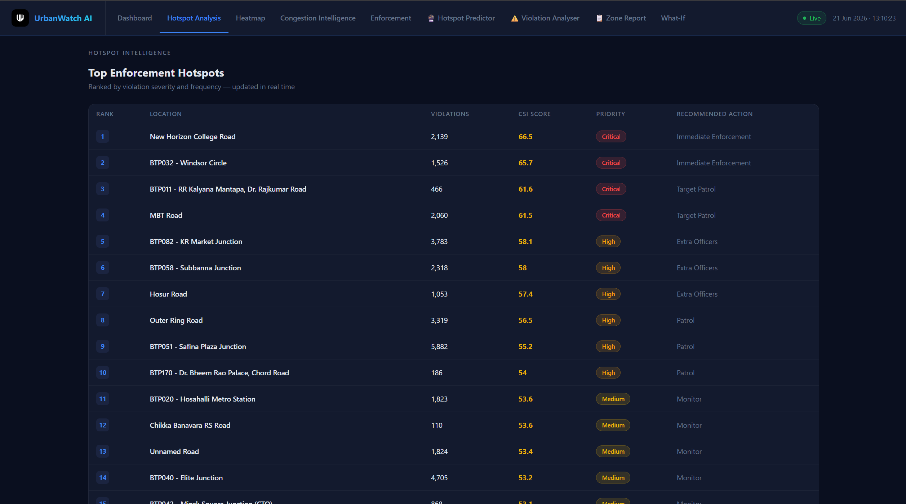
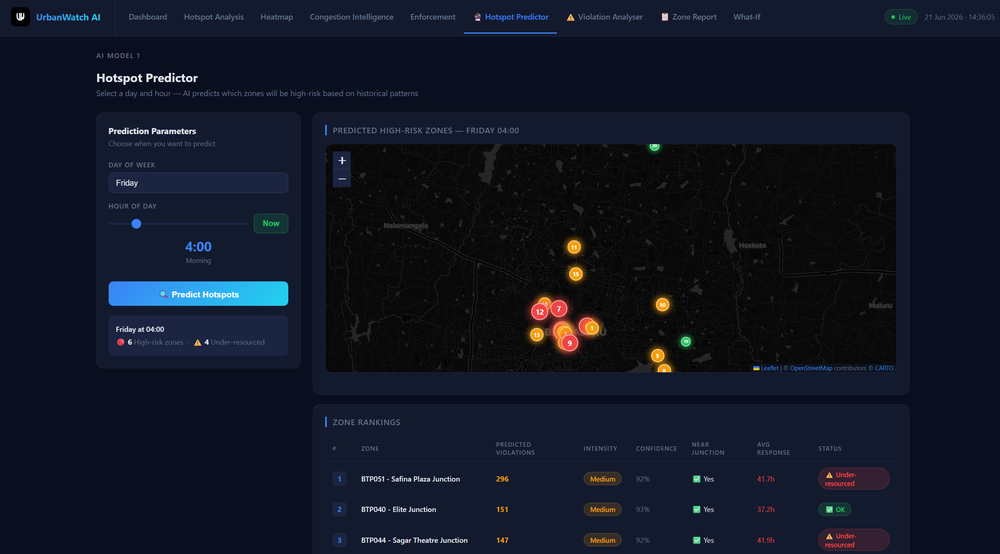
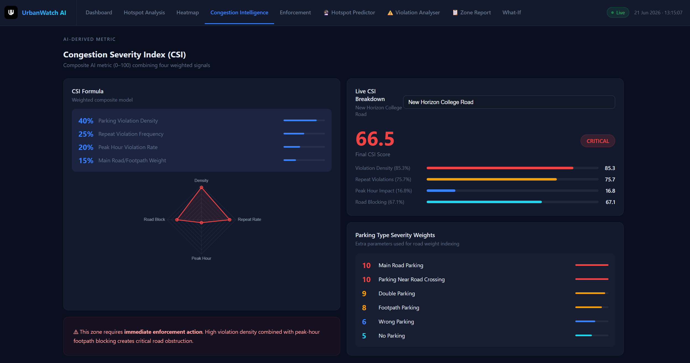
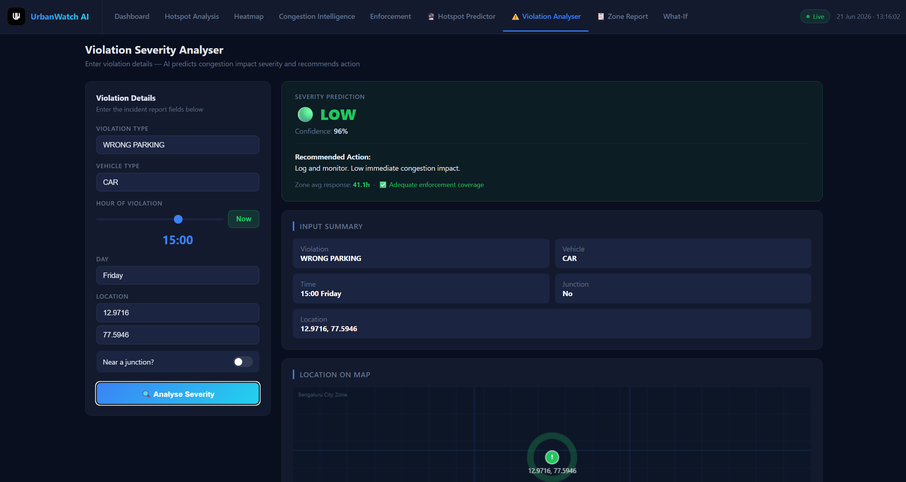
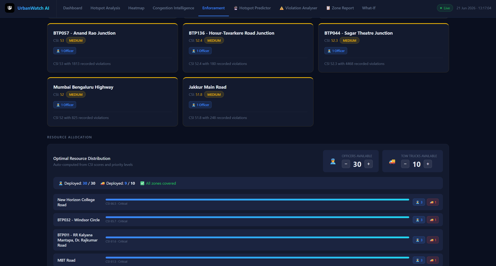
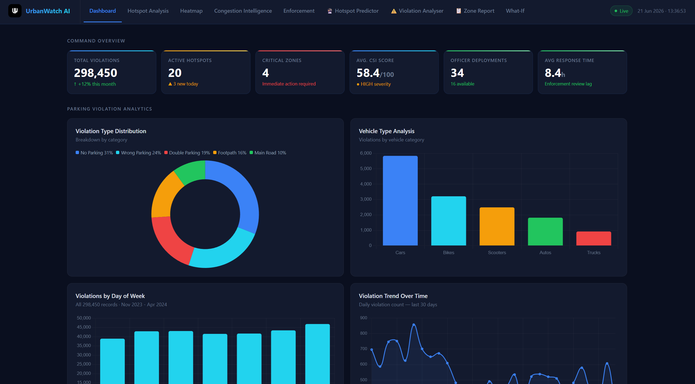
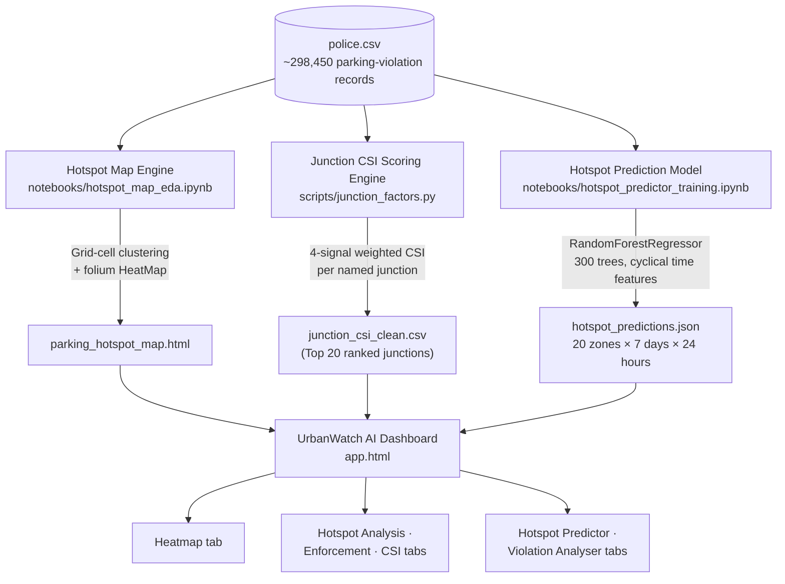
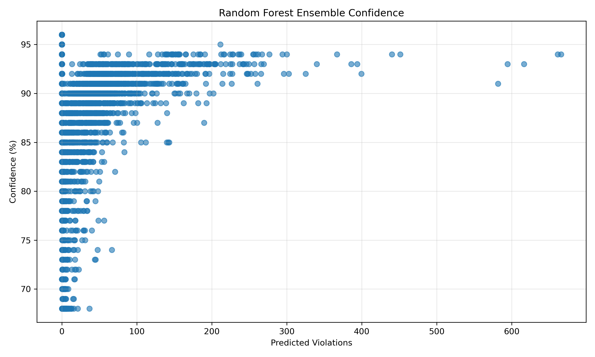

### AI-driven parking intelligence that turns raw violation data into targeted enforcement decisions

[](https://www.python.org/)
[](https://scikit-learn.org/)
[](https://pandas.pydata.org/)
[](https://python-visualization.github.io/folium/)
[](LICENSE)
[](https://gridlock2point0.hackerearth.com/)
[](https://www.flipkart.com)
</div>

---
<p align="center">
  <a href="https://skill-map-nine.vercel.app/">
    
  </a>
</p>

## Problem Statement

<table>
<tr>

<td width="140" align="center" valign="middle">


</td>

<td valign="top">

### Theme: Poor Visibility on Parking-Induced Congestion

Illegal and spillover on-street parking near commercial strips, metro stations, and event venues regularly chokes carriageways and intersections — but enforcement today is patrol-based and reactive. There's no map connecting where violations happen to how much congestion they actually cause, which makes it hard to know where to send limited officers and tow trucks first.

**Our question:** how can AI-driven parking intelligence detect illegal-parking hotspots and quantify their traffic-flow impact, so enforcement can be targeted instead of random?

</td>

</tr>
</table>

## What We Built

**UrbanWatch AI** is a single-page enforcement dashboard backed by three independent data-science components, all trained on real Bengaluru Traffic Police parking-violation records (`police.csv`, ~298K rows). Together they answer three different questions:

| Question | Component | Output |
|---|---|---|
| *Where, geographically, is parking congestion worst?* | **Hotspot Map Engine** | Interactive heatmap (`parking_hotspot_map.html`) |
| *Which named junctions need enforcement first, and why?* | **Junction CSI Scoring Engine** | Top-20 ranked junctions with a 0–100 Congestion Severity Index |
| *When will a given zone be high-risk, and how severe is a specific violation report?* | **Hotspot Prediction Model** | Day/hour risk grid (`hotspot_predictions.json`) consumed live by the dashboard |

All three feed into `app.html`, a single-file dashboard with 9 views: Command Overview, Hotspot Analysis, Heatmap, Congestion Intelligence (CSI), Enforcement, Hotspot Predictor, Violation Severity Analyser, Zone Report, and a What-If simulator for testing enforcement scenarios.

## Screenshots

<table>
<tr>
<td width="50%">

**Hotspot Analysis — Top 20 CSI-ranked junctions**


</td>
<td width="50%">

**Hotspot Predictor — day/hour risk forecast**


</td>
</tr>
<tr>
<td width="50%">

**Congestion Severity Index breakdown**


</td>
<td width="50%">

**Violation Severity Analyser**


</td>
</tr>
<tr>
<td width="50%">

**Enforcement recommendations**


</td>
<td width="50%">

**Command overview dashboard**


</td>
</tr>
</table>

<p align="center">
  
  
  
  
</p>

## Architecture



## The three models

### 1. Hotspot Map Engine — `notebooks/hotspot_map_eda.ipynb`

Exploratory analysis plus an unsupervised geo-clustering pass:

- Bins every GPS-tagged, approved violation into a **0.001°×0.001° grid cell** (≈100m) and keeps cells with ≥10 violations.
- Scores each cell with a 3-signal **Congestion Impact Score**:

  `score = 0.5 × violation density + 0.3 × junction proximity + 0.2 × peak-hour share`

- Renders an interactive **Folium heatmap** (dark-matter basemap) with a `HeatMap` density layer, ranked `CircleMarker`s for the top hotspot cells, and a `MarkerCluster` of the busiest named junctions.
- Outputs: `eda_overview.png` (4-panel EDA), `hotspot_clusters.csv`, **`parking_hotspot_map.html`** (the file the dashboard's Heatmap tab embeds in an iframe).

### 2. Junction CSI Scoring Engine — `scripts/junction_factors.py`

Turns raw violations into a single, explainable **Congestion Severity Index (0–100)** per named junction:

| Signal | Weight | What it measures |
|---|---|---|
| Violation Density | 40% | Total approved violations at the junction |
| Repeat Violation Frequency | 25% | Violations per unique vehicle (`violations ÷ unique vehicles`) |
| Peak-Hour Violation Rate | 20% | Share of violations in 8–11 AM / 5–9 PM windows |
| Road/Parking-Type Weight | 15% | Severity-weighted mix of violation types at that junction |

Each raw signal is **robust min-max scaled** (5th–95th percentile clipping, so a handful of outlier junctions can't distort the 0–100 scale) before the weighted sum is taken. Parking-type severity weights:

| Violation type | Weight |
|---|---|
| Parking in a Main Road | 10 |
| Parking Near Road Crossing | 10 |
| Double Parking | 9 |
| Parking on Footpath | 8 |
| Wrong Parking | 6 |
| No Parking | 5 |

Output: `junction_csi_clean.csv` — the ranked top-20 list (with all 4 component scores + final CSI) that powers the **Hotspot Analysis**, **Enforcement**, and **Congestion Intelligence** tabs.

### 3. Hotspot Prediction Model — `notebooks/hotspot_predictor_training.ipynb`

A supervised model that answers *"how many violations should I expect at zone X, on day D, at hour H?"*

- Selects the **top 20 zones by raw violation volume**, then builds a fully-enumerated training table: 20 zones × 7 days × 24 hours = 3,360 rows, with cyclical `sin`/`cos` encodings for hour-of-day and day-of-week so the model understands that 23:00 and 00:00 are adjacent.
- Trains a **`RandomForestRegressor`** (300 trees, max depth 12, min 2 samples/leaf) on **123,734 records** to predict violation count per zone/day/hour cell.
- Re-predicts every cell using each tree individually to derive a **confidence score** from the ensemble's prediction variance (low variance → high confidence, scaled to 65–97%), and labels each cell **Low / Medium / High** based on its intensity relative to that zone's peak hour.
- Serializes everything into **`hotspot_predictions.json`** — a fully-enumerated O(1) lookup table, so the live dashboard never re-runs the model; it just looks up `grid[zone][day][hour]`.

This single JSON file powers **both** the Hotspot Predictor (pick a day/hour, see ranked risk zones) and the Violation Severity Analyser (enter a violation report, get the nearest zone's risk + a severity nudge based on violation type, vehicle type, and junction proximity).

## Dataset

- **Source:** Bengaluru Traffic Police parking-violation records (`police.csv`) — `[insert dataset link here]`
- **Scale:** ~298,450 total records; 123,734 of those fall within the 20 highest-volume zones used for model training
- **Key fields used:** `created_datetime`, `latitude`/`longitude`, `location`, `junction_name`, `violation_type`, `vehicle_type`, `vehicle_number`, `validation_status`, `validation_timestamp`

The dataset is not owned, created, or maintained by the project authors and is used solely for research, analysis, and model development purposes.

For licensing and distribution terms, please refer to the original data provider.

## Project structure

```
UrbanWatch-ai/
├── README.md
├── LICENSE
├── UrbanWatch.html                      
├── hotspot_predictions.json        
├── parking_hotspot_map.html       
├── notebooks/
│   ├── hotspot_map_eda.ipynb          
│   └── hotspot_predictor_training.ipynb
├── scripts/
│   └── junction_factors.py            
├── data/
│   └── police.rar             
└── assets/
    ├── logo.jpg
    ├── rf_confidence_scatter.png
    └── screenshot-*.png
```


# Getting Started

## Run the Dashboard (Recommended)

This launches the final UrbanWatch AI dashboard used for demonstration.

```bash
git clone https://github.com/<your-org>/UrbanWatch-ai.git
cd UrbanWatch-ai

python -m http.server 8000
```

Open:

```text
http://localhost:8000/app.html
```

A local HTTP server is required because the dashboard loads:

```text
hotspot_predictions.json
```

using JavaScript `fetch()`, which may be blocked by browser CORS restrictions when opening the HTML file directly.


## Reproduce the Models

### Install Dependencies

```bash
pip install pandas numpy scikit-learn matplotlib seaborn folium jupyter
```

### Provide Input Data

Place the dataset inside the repository:

```text
data/police.rar
```
in the repository root directory.
Then extract it before running any models:
```bash
# Extract dataset
unrar x data/police.rar data/
```
After extraction, ensure this file exists:
```text
data/police.csv
```
## Model 1 — Parking Violation Hotspot Analysis

```bash
jupyter nbconvert --to notebook --execute notebooks/hotspot_map_eda.ipynb
```

Output:

```text
parking_hotspot_map.html
```

Copy the generated file to the repository root if required by the dashboard.


## Model 2 — Junction Congestion Severity Index (CSI)

```bash
python scripts/junction_factors.py
```

Output:

```text
junction_csi_clean.csv
```


## Model 3 — Hotspot Prediction Engine

```bash
jupyter nbconvert --to notebook --execute notebooks/hotspot_predictor_training.ipynb
```

Outputs:

```text
hotspot_predictions.json
rf_confidence_scatter.png
top_predicted_hotspots.png
```

Copy:

```text
hotspot_predictions.json
```

to the repository root if required by the dashboard.


## Expected Outputs

After successful execution, the repository should contain:

```text
app.html
hotspot_predictions.json
junction_csi_clean.csv
parking_hotspot_map.html
rf_confidence_scatter.png
```

The dashboard will automatically consume the generated prediction data from:

```text
hotspot_predictions.json
```
---

## Tech stack

| Layer | Tools |
|---|---|
| Data processing | pandas, numpy |
| Machine learning | scikit-learn (`RandomForestRegressor`), `DBSCAN`-ready clustering |
| Geospatial | folium, Leaflet (via folium), `HeatMap` / `MarkerCluster` plugins |
| Visualization (EDA) | matplotlib, seaborn |
| Frontend | vanilla HTML/CSS/JS, Chart.js (radar/bar/line/scatter charts) |
| Data interchange | static JSON lookup table |

## 👥 Team

<table>
<tr>
<td>Rohit Manoj Nair</td>
<td>
<a href="https://www.linkedin.com/in/rohit-manoj/">

LinkedIn
</a>
</td>
</tr>

<tr>
<td>Diksha Swami</td>
<td>
<a href="https://www.linkedin.com/in/diksha-swami-7a17193b0/">

LinkedIn
</a>
</td>
</tr>

<tr>
<td>Madhav Kedia</td>
<td>
<a href="https://www.linkedin.com/in/madhav-kedia-588474314/">

LinkedIn
</a>
</td>
</tr>

<tr>
<td>Jacob Sadeesh Palet</td>
<td>
<a href="https://www.linkedin.com/in/jacob-sadeesh-palet-b8aab7230/">

LinkedIn
</a>
</td>
</tr>
</table>

## License

This project is licensed under the [MIT License](LICENSE).

## Acknowledgments

- Built for **Gridlock Hackathon 2.0** — Theme: *Poor Visibility on Parking-Induced Congestion*
- Dataset: Bengaluru Traffic Police parking-violation records

<h2>👤 Author</h2>
<p>
  <b>Rohit Manoj Nair</b>
</p>
<p>
   
  Email: rohitmknair@gmail.com
</p>

<p>
   
  LinkedIn: https://www.linkedin.com/in/rohit-manoj/
</p>
